# 🏗️ Architecture: Django Backend Proxy for n8n

This document outlines the architecture for a secure Django backend that acts as a proxy between your React Frontend and n8n automation workflows.

## 🎯 Objective
To securely trigger n8n workflows from the Frontend without exposing n8n Webhook URLs or API keys to the client browser, while leveraging Django's authentication and validation capabilities.

## 📊 System Architecture

```mermaid
sequenceDiagram
    participant User as 👤 User (Frontend)
    participant Django as 🛡️ Django API (Proxy)
    participant n8n as ⚡ n8n Workflow
    participant External as ☁️ External Services

    User->>Django: POST /api/workflows/trigger/ <br/> (Auth Token + Data)
    Note over Django: 1. Verify Auth (JWT/Session)<br/>2. Validate payload schema<br/>3. Rate Limit check<br/>4. Select n8n Webhook URL
    Django->>n8n: POST https://n8n.your-domain.com/webhook/... <br/> (Validated Data + Metadata)
    
    par Async Processing
        Django-->>User: 202 Accepted <br/>(Workflow Started)
    and
        n8n->>External: Perform Actions (Slack, Email, DB)
    end
```



## 🔐 Key Components & Responsibilities

### 1. Frontend (React)
- **Responsibility**: capturing user input and initiation.
- **Action**: Sends a standard authenticated API request to Django.
- **Awareness**: IT DOES NOT know about n8n. It only knows about `POST /api/workflows/trigger/`.

### 2. Backend (Django) - The "Proxy"
- **Authentication**: Ensures only logged-in users (or specific roles) can trigger workflows.
- **Registry**: Maintains a mapping of `action_id` to `n8n_webhook_url`.
    - *Example*: `SEND_WELCOME_EMAIL` -> `https://n8n.com/webhook/abc-123`
- **Validation**: Uses Pydantic or DRF Serializers to ensure the data meant for n8n is correct before sending it.
- **Security**:
    - Adds a "Secret Header" to the request sent to n8n (e.g., `X-N8N-SECRET: my-secret-key`).
    - n8n checks this header to ensure the request came from *your* Django, not the public internet.

### 3. n8n (Automation Engine)
- **Trigger**: Webhook node (HTTP Method: POST).
- **Security**: Configured to check headers for the shared secret.
- **Logic**: Executes the business logic (Integration with Slack, Stripe, OpenAI, etc.).

---

## 🛠️ Implementation Strategy

### Phase 1: Models & Configuration
Create a structure to manage these triggers dynamically or statically.

**Option A: Static Logic (Simpler, Hardcoded)**
```python
# views.py
WEBHOOKS = {
    "generate_report": os.environ.get("N8N_WEBHOOK_REPORT"),
    "sync_contacts": os.environ.get("N8N_WEBHOOK_SYNC"),
}

def trigger_workflow(request):
    action = request.data.get("action")
    url = WEBHOOKS.get(action)
    # ... send request
```

**Option B: Dynamic Models (Database Driven)**
Create a `WorkflowTrigger` model in Django Admin.
- `name`: "Generate Report"
- `slug`: "generate-report" (Frontend uses this)
- `n8n_url`: "https://..."
- `is_active`: Boolean
- `required_role`: "admin"

### Phase 2: The Proxy View
A generic Django Rest Framework (DRF) view to handle the traffic.

```python
class TriggerWorkflowView(APIView):
    permission_classes = [IsAuthenticated]

    def post(self, request):
        workflow_slug = request.data.get("slug")
        payload = request.data.get("payload")
        
        # 1. Look up URL
        workflow = get_object_or_404(WorkflowTrigger, slug=workflow_slug)
        
        # 2. Forward Request to n8n (Server-to-Server)
        try:
            headers = {"X-Internal-Secret": settings.N8N_SECRET_KEY}
            response = requests.post(workflow.n8n_url, json=payload, headers=headers)
        except RequestException:
            return Response({"error": "Failed to reach automation server"}, status=500)

        return Response({"status": "queued"}, status=202)
```

### Phase 3: n8n Security
In your n8n Webhook Node Authentication settings:
- **Authentication**: Header Auth
- **Header Name**: `X-Internal-Secret`
- **Header Value**: (Must match Django `settings.N8N_SECRET_KEY`)

## 🚀 Benefits of this Architecture
1.  **Security**: Your n8n URLs are never visible in the browser "Network" tab.
2.  **Audit Logs**: You can log every trigger attempt in Django (`WorkflowLog` model).
3.  **Flexibility**: You can swap n8n for Zapier or a Lambda function later by just changing the URL in Django DB.
4.  **Enriched Data**: Django can inject extra data (e.g., `user_id`, `user_email`) into the payload that the Frontend might not strictly send.
